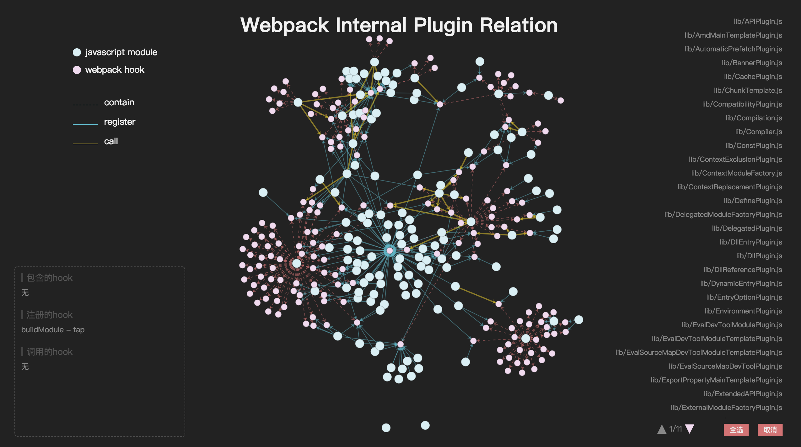
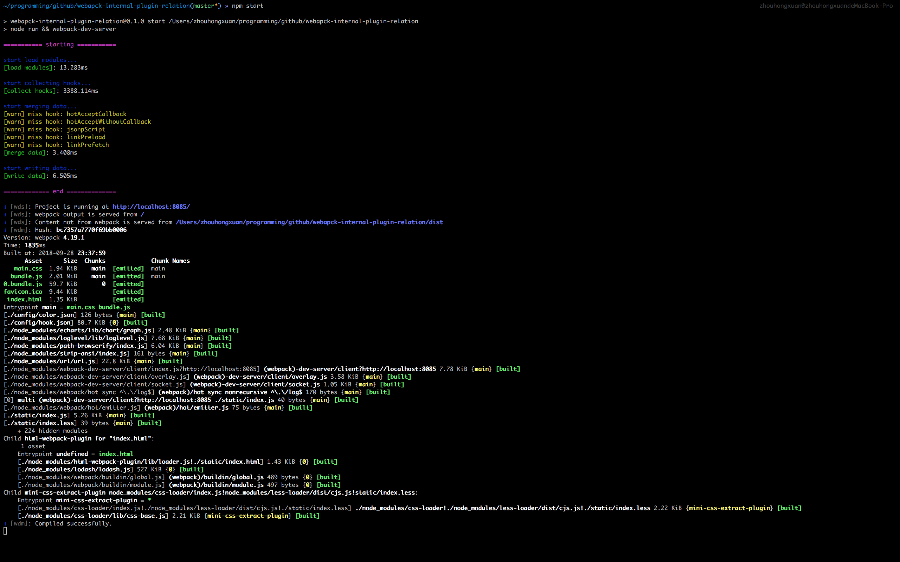

# webpack-internal-plugin-relation

> 目前支持 webpack v4+

## 介绍

一个用来展示webpack内置插件调用关系（钩子）的小工具。

[https://alienzhou.github.io/webpack-internal-plugin-relation](https://alienzhou.github.io/webpack-internal-plugin-relation)

也许可以用来帮助理清webpack内部插件之间的关系，促进webpack源码结构的理解与阅读。



## 起因

- webpack使用tapable的钩子虽然能有效解耦，但是类似事件监听这种模式，其注册与调用几乎完全无关，很难将一个钩子的创建 - 注册 - 调用有效联系起来。对此，往往只能使用关键词搜索。

- webpack内部的钩子非常多，数量达到了180+。除了官网列出的`compiler`与`compilation`中那些常用的钩子，还存在着众多其他可以使用的钩子。有些挺有用的钩子你可能都无从知晓。

- webpack v4+ 本身内置了许多插件，即使非插件，webpack的模块也经常使用tapable钩子来交互。甚至你可以认为，webpack项目中的各个模块都是“插件化”的。这也使得模块间的调用与方法的触发关系更加不明确了。

这些主要导致了，想要全局细致了解webpack中模块（插件）、钩子之间的关系具有一定的困难。为了帮助理解与阅读webpack源码，我制作了一个工具应用，来进行可视化展示，并支持一些交互操作。

## 演示

**关系展示：**


**点击交互，展示模块信息，跳转到相应源码位置：**


**筛选关系类型进行展示：**


## 功能

- 收集webpack内部插件中钩子的创建、注册、调用关系，并生成原始数据
- 力导向图可视化展示插件、钩子间关系
- 支持力导向图节点的选择
- 单击javascript module类节点，可在左下角展示详细信息
- 双击javascript module类节点，可直接打开webpack对应源码查看
- 双击节点间关系，可直接打开并定位源码具体行数，进行查看
- ……

## 使用

你可以直接启动查看应用效果，或者只是生成所需的关系数据，或者构建应用并托管在自己的网站……

### 启动服务预览

```bash
# 安装依赖
npm i

# 启动服务
npm start
```



启动完成后可以在 `127.0.0.1:8085` 上看到服务

### 生成plugin与hook相关数据

如果不想使用力导向图功能，只是需要plugin、hook之间的关系数据，可以

```bash
npm run data
```

生成的数据在 `config/` 目录下：

- hook.json: plugin与hook收集的原始数据
- forceData.json: 整理合并的力导向图数据


### 应用构建

```bash
npm run build
```

生成的静态文件位于 `dist/` 目录下，可将站点应用托管至任何静态文件服务器。
